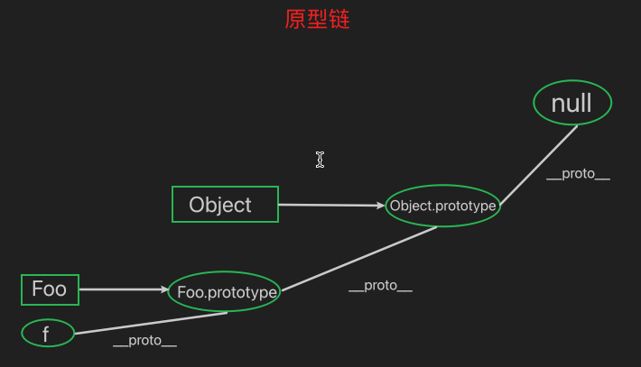

<!--
 * @Author: 肖玲
 * @Date: 2024-04-24 15:29:02
 * @LastEditTime: 2024-04-30 10:22:47
 * @LastEditors: 肖玲
 * @Description:
 * @FilePath: /javascript_Handwritten_code/03_JS三座大山.md
 * JS三座大山
-->

# 前言

# 如何全面学好 JS？如何精通？

## 1、重难点：JS 的三座大山（this、原型、异步）

## 2、标准库：Array(push,shift)、Function(call,bind)、Date、RegExp

## 3、浏览器提供的 DOM 和 BOM(现在叫作 Web APIs)

## 4、封装技巧：闭包、原型链、表驱动、最小知识原则、DRY 原则、API 正交原则、重载、链式调用

## 5、MV 思想：理解 MVC、MVP、MVVM 的设计意图

## 6、框架：Vue、React 及其全家桶

PS：先学 1 然后学习 2 接着学习 3 然后学 4 再然后学习 5 最后学习 6、很可惜，很多人跳过了 1 2 3 4 5 直接学习 6，这会导致 JS 永远也学习不好！！！

本文章比较适合三年以上的前端工作者，JS 三座大山分别指：原型与原型链，作用域及闭包，异步与单线程。本整理文章的时候包括实习经历，从事前端工作两年零六个月

## JS 三座大山

### 一、原型与原型链

说到原型，就不得不提一下构造函数，首先我们看下面一个简单的例子：

```javascript
function Dog (name,age){
    this.name = name;
    this.age = age;
}
let dog1 = new Dog('哈士奇',2)
let dog2 = new Dog('泰迪',3)
```

首先创造空的对象，再让this指向这个对象，通过this.name进行赋值，最终返回this,这其实也是new一个对象的过程。
其实：let obj = {}是let obj = new Object()的语法糖；let arr = []是let arr = new Array()的语法糖；function Dog(){...}是let Dog = new Function()的语法糖。

#### 那什么是原型呢？

在js中，所有对象都是Object的实例，并且继承Object.prototype的属性和方法，但是有一些是隐性的。

#### 原型的规则

**1、** 所有的引用类型（包括数组、对象、函数）都具有对象特性；可自由扩展属性。

```javascript
var obj = {}
obj.attributr = "三座大山"
var arr = []
arr.attribute = "三座大山"
function fn1 (){}
fn1.attribute = "三座大山"
```

**2、** 所有的引用类型（包括数组、对象、函数）都有隐性原型属性（**proto**），值也是一个普通对象。

```javascript
condole.log(obj.__proto__)
```

**3、** 所有的函数，都有一个prototype属性，值也是一个普通的对象。

```javascript
condole.log(obj.prototype)
```

**4、** 所有的引用类型的__proto__属性都指向构造函数的peototype属性值。

```javascript
console.log(obj.__proto__ === Object.prototype) //true
```

**5、** 当试图获取对象属性时，如果对象本身没有这个属性，那就会去它的__proto__（prototype）中寻找。

```javascript
function Dog(name){
    this.name = name
}
Dog.prototype.callName = function (){
    console.log(this.name,'WangWang')
}
let dog1 = new Dog('Three mountain')
dog1.printName = function (){
console.log(this.name)
}
dog1.callName() //Three mountain WangWang
dog1.printName() //Three mountain
```

**原型链:** 如下图


我找一个属性，首先会在f.__proto__中去找，因为属性值为一个对象，那么就会去f.**proto**.__proto__去找，同理如果还没找到，就会一直向上去查找，直到结果为null为止。这个串起来的链即为原型链。

### 二、作用域及闭包

讲到作用域，第一时间会想到的当然是执行上下文。每个函数都有自己的excution context和variable Object。这些环境用于储存上下文中的变量，函数声明，参数等等。只有函数才能制造作用域。
ps: for, if else 不能创造作用域。

```javascript
console.log(a); //undefined
var a = 1

// 可以理解为
var a 
console.log(a)
a = 1
```

执行console.log的时候，a只是被声明出来，并没有赋值；所以控制台打印出来的结果是undefined。

#### this

本质上来说，在js中this是一个指向函数执行环境的<font color=#FF00FF >指针</font>。this永远指向最后调用它的对象，并在执行时才能获取值，定义是无法确认它的值。

```javascript
var a = {
    name:'A',
    fn: function(){
        console.log(this.name)
    }
}
a.fn() // this === a
// a调用了fn(),所以此时this指向a

a.fn.call({name:'B'})   //this === {name:'B'}
// 使用call()，将this的值指定为{name:'B'}

var fn1 = a.fn
fn1() //this === window
// 虽然指定了fn1 = a.fn,但是调用是由window调用的，所以this指向window
```

this有多种使用场景，下面主要介绍以下4个使用场景：
**1、作为构造函数执行**

```javascript
function Student(name,age){
    this.name = name  //this === student
    this.age = age    //this === student
}
var student = new Student()
```

首先<font color=#FF00FF >new</font>字段会创建一个空对象，然后使用<font color=#FF00FF >apply()</font>函数，将this指向这个空对象。这样的话，函数内部的this就会被空对象替代。
**2、作为普通函数执行**

```javascript
function fn(){
    console.log(this)  //this === window
}
fn()
```

**3、作为对象属性执行** 

```javascript
var obj = {
    name:'A',
    printName:function(){
        console.log(this.name) //this === obj
    }
}
obj.printName()
```

**4、call()、apply()、bind()** 
三个函数可以修改this的指向，具体差异请往下看：

```javascript
var name = '小明',age = '17'
var obj = {
    name: '安妮',
    objAge: this.age
    fun: function(){
        console.log(this.name + '今年' + this.age)
    }
}
console.log(obj.objAge) //17
obj.fun() //安妮今年undefined
```

```javascript
var name = '小明',age = '17'
var obj = {
    name: '安妮',
    objAge: this.age,
    fun: function(like,dislike){
        console.log(this.name + '今年' + this.age,  '喜欢吃' + like + '不喜欢吃' + dislike)
    }
}
var a ={name: 'Jay', age: 23}
obj.fun.call(a,'苹果','香蕉')  // Jay今年23，喜欢吃苹果不喜欢吃香蕉
obj.fun.apply(a,['苹果','香蕉'])  // Jay今年23，喜欢吃苹果不喜欢吃香蕉
obj.fun.bind(a,'苹果','香蕉')()  // Jay今年23，喜欢吃苹果不喜欢吃香蕉
```

首先call、apply、bind的第一个参数都是this的指向对象，call和apply如果第一个参数指向null或者undefined时，那么this是指向<font color=#FF00FF >window对象</font>。
call、 apply、 bind的执行方式如上面代码所示。call和apply都是改变上下文中的this指向，并且是立即执行的，区别在于传递参数的形式不同，call是单个参数传递，apply则支持数组格式传参。bind方法可以让对应的函数想什么时候调用就什么时候调用。

#### 闭包

闭包的概念比较抽象，看看下面的例子帮助理解一下：

```javascript
function a(){
    var n = 0
    this.fun = function(){
        n++
        console.log(n)
    }
}
var c = new a()
c.fun() // 1
c.fun() // 2
```

闭包就是能够读取其他函数内部变量的函数。在js中只有函数内部的子函数才能读取局部变量，所以可以简单理解为：定义在函数内部的函数。
用途主要有两个：

- 前面提到的，读取函数内部的变量
  
- 让变量始终保持在内存中

### 三、异步和单线程

我们先感受一下异步：

```javascript
console.log('start')
setTimeout(()=>{
    console.log('medium')
},1000)
console.log('end')
```

使用异步后，打印的顺序是start->end->medium。因为<font color=#FF00FF >没有阻塞</font>。

#### 为什么会产生异步呢？

首先因为js它是一门单线程语言，也就是说CPU同一时间只能处理一个事务，得按顺序，一个一个处理。
如上例所示，第一步：执行第一行打印'start'；
          第二步：执行setTimeout,将其中的函数封存起来，等待时间结束后执行；
          第三步：执行最后一行，打印'end'；
          第四步：处于空闲状态，查看暂存中是否有可执行函数；
          第五步：执行封存函数。

#### 为什么js引擎是单线程？

js的主要用途是与用户互动，以及操作<font color=#FF00FF >DOM</font>,这就决定了它只能是单线程。例：一个线程要操作添加DOM，一个线程要操作删除DOM，这就会造成分歧。
为了更好地使用多CPU，H5提供了<font color=#FF00FF >web Worker标准</font>，允许js创建多线程，但是子线程受到主线程控制，而且不得操作DOM。

#### 任务队列

单线程就意味着，所有的任务都要排队，前一个结束，才会执行后面的任务。如果列队是因为计算量大，CPU忙不过来，倒也算了。但是更多的时候，CPU是闲置的，因为IO设备处理得很慢，例如ajax读取网络数据。js设计者便想到，主线程可以完全不管IO设备，将其挂起，然后执行后面的任务。等后面的任务结束掉，再反过头来处理挂起的任务。
我们梳理一下：

- 所有的同步任务都在主线程上面执行，形成一个执行栈。
- 除了主线程外，还存在一个任务队列。只要异步任务有了运行结果，就在任务队列中植入一个时间。
- 主线层完成所有任务，就会读取任务队列，并将其执行。
- 重复上面三步。
只要主线程空了，就会读取任务队列，这是js的运行机制，也被称为<font color=#FF00FF >event loop</font>(事件循环）。
