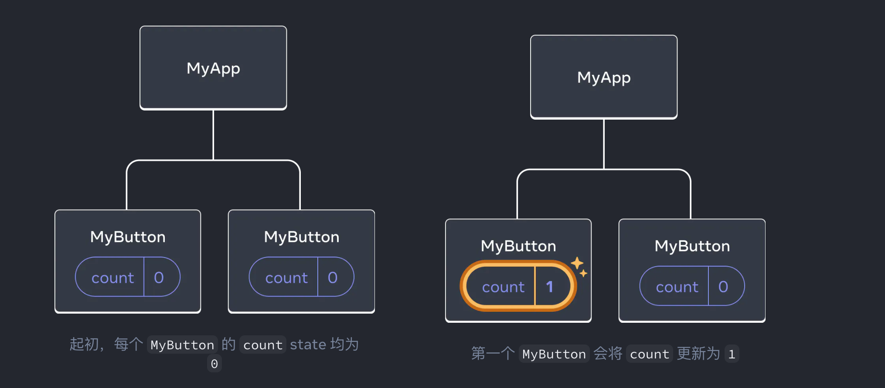
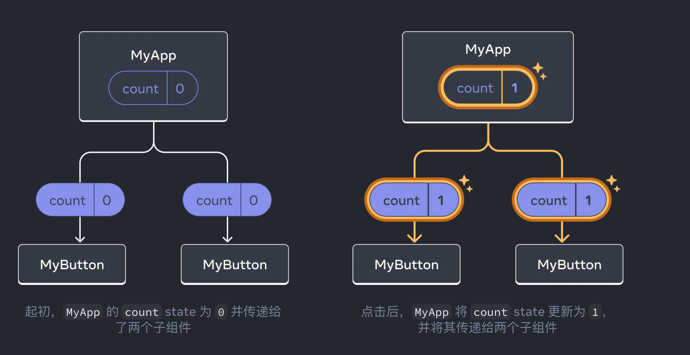

<!--
 * @Author: 肖玲
 * @Date: 2024-05-08 11:02:35
 * @LastEditTime: 2025-03-03 10:48:22
 * @LastEditors: 肖玲
 * @Description:
 * @FilePath: /javascript_Handwritten_code/interview/04_React官方文档读后感.md
 * React官方文档读后感
-->

# React 官方文档读后感

## 1、使用 Hook

以 use 开头的函数被称为 Hook。useState 是 React 提供的一个内置 Hook。也可以通过组合现有的 Hook 来编写属于自己的 Hook。 **Hook 比普通函数更为严格。你只能在你的组件（或其他 Hook）的顶层调用 Hook。如果你想在一个条件或循环中使用 useState,请提取一个新的组件并在组件内部使用它。** _这句话的意思是：在函数组件中使用 Hook 时，必须确保 Hook 的调用始终发生在组件函数的顶层，不能在嵌套的条件语句、循环或子函数中使用 Hook。这是因为 React 依赖于 Hook 的调用顺序来正确地跟踪状态，并确保状态的一致性。如果 Hook 在不同的渲染阶段被调用很多次，React 将无法保证状态的一致性，这会导致意料之外的结果。_ 为了理解这句话，通过一个例子来说明：

```javascript
import React,{useState} from 'react'
function Counter(){
    const [count setCount] = useState(0)
    if(count == 0){
        const [text,setText] = useState('Hello')
    }
    return (
        <div>
            <p>You clicked {count} times</p>
            <button onClick={()=>setCount(count + 1)}>Click me</button>
        </div>
    )
}
export default Counter
```

_在这个例子中，我们尝试在计数器组件中的条件语句中调用'useState'。这是不允许的，因为条件语句可能在每次渲染时都会执行，导致'useState'在不同的渲染阶段调用多次。这样做会导致 React 无法正确地跟踪状态，可能会引发错误。_ 要解决这个问题，我们可以将条件语句内部的逻辑提取到一个新的组件中，确保'useState'的调用发生在这个组件函数的顶层，而不是在条件语句中：

```javascript
import React, { useState } from 'react'
function TextComponent() {
    const [text, setText] = useState('Hello')
    return <p>{text}</p>
}
function Counter() {
    const [count, setCount] = useState(0)
    return (
        <div>
            <TextComponent />
            <p>You clicked {count} times</p>
            <button onClick={() => setCount(count + 1)}>Click me</button>
        </div>
    )
}
```

_在这个修正后的版本中，我们将条件语句内部逻辑提取到了一个名为'TextComponent'的新组件中。这样就确保了'useState'的调用发生在组件函数的顶层，遵循了 Hook 的使用规则。_

## 2、组件间共享数据

_多次渲染同一个组件，每个组件都会有自己的 state_

```javascript
import { useState } from 'react'
function MyButton() {
    const [count, setCount] = useState(0)
    function handleClick() {
        setCount(count + 1)
    }
    return <button onClick={handleClick}>Clicked {count} times</button>
}
export default function MyApp() {
    return (
        <div>
            <h1>Counters that update separately</h1>
            <MyButton />
            <MyButton />
        </div>
    )
}
```

在上面的事例中，每个 MyButton 都有自己独立的 count,当每个按钮被点击的时候，只有被点击的按钮的 count 才会发生改变：  _然而，在很多业务场景中，经常需要多个组件共享数据一起更新：为了使得 MyButton 组件显示相同的 count 并一起更新，你需要将各个按钮的 state"向上"移动到最接近包含所有按钮的组件（上面事例是 MyApp）之中_  _此时，当你点击任意一个按钮时，MyApp 中的 count 都将改变，同时会改变 MyButton 中的两个 count。具体代码如下：_

_首先，将 MyButton 的 state 上移到 MyAPP 中：_

```javascript
function MyButton() {
    // we are moving code from here...
}
export default function MyApp() {
    const [count, setCount] = useState(0)
    function handleClick() {
        setCount(count + 1)
    }
    return (
        <div>
            <h1>Counters that update separately</h1>
            <MyButton />
            <MyButton />
        </div>
    )
}
```

_接着，将 MyApp 中的点击事件处理函数以及 state 一同向下传递到每个 MyButton 中。可以使用 JSX 的大括号向 MyButton 传递信息：使用这种方法传递的信息在子组件中被称作 prop。此时 MyApp 组件包含了 count,state 以及 handleClick 事件处理函数。并将它们作为 prop 传递给每个按钮。_

```javascript
function MyButton() {
    // we are moving code from here...
}
export default function MyApp() {
    const [count, setCount] = useState(0)
    function handleClick() {
        setCount(count + 1)
    }
    return (
        <div>
            <h1>Counters that update together</h1>
            <MyButton count={count} onclick={handleClick} />
            <MyButton count={count} onclick={handleClick} />
        </div>
    )
}
```

_最后，改变 MyButton 读取从父组件传过来的 prop。_

```javascript
function MyButton({ count, onClick }) {
    return <button onClick={onClick}>Clicked {count} times</button>
}
```

_当点击按钮时，onClick 处理程序会启动。每个按钮 onClick prop 会被设置为 MyApp 内的 handleClick 函数，所以函数的代码会被执行。该代码会调用 setCount 函数，使 state 变量 count 递增。新的 count 会被作为 prop 传递给每个按钮，因此他们每次展示的都是最新状态值。这被称为<font color=#FF00FF >状态提升</font>。通过向上移动 state，实现了组件间的数据共享。_

```javascript
// 原型链知识点测试
function Person(name) {
    this.name = name
}

Person.prototype.greet = function () {
    console.log('Hello, my name is ' + this.name)
}

const alice = new Person('Alice')
alice.greet() //

console.log(Person.__proto__ === Function.prototype, '111')
console.log(Person.__proto__ === Object.prototype, '222')
```
