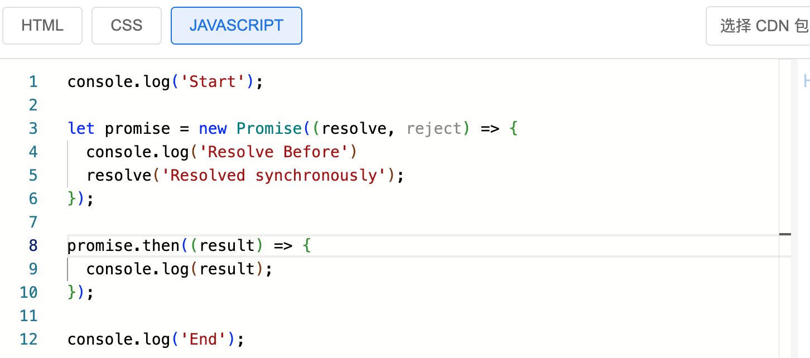
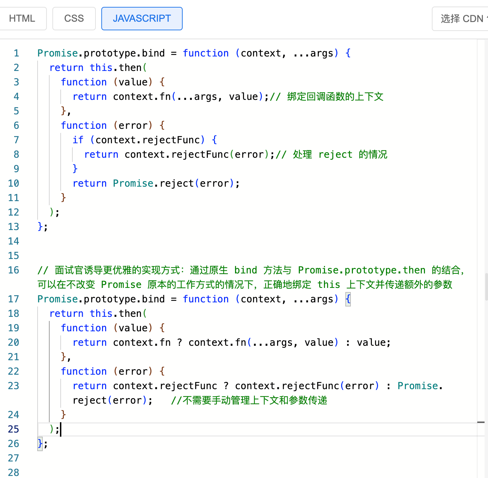

<!--
 * @Author: 肖玲
 * @Date: 2025-03-26 15:22:51
 * @LastEditTime: 2025-03-26 17:57:16
 * @LastEditors: 肖玲
 * @Description:
 * @FilePath: /javascript_Handwritten_code/interview/05_BDInterview.md
 * 百度面经整理
-->

# 一面

### 1、说说你平常工作中常用到到的一些 ES6 的新特性（拓展问到了数组常用的 API（哪些会改变原属组哪学些不会，提到了增删改都可以用 Splice 所以面试官问到了这个 API 的具体入参以及第三个参数的入参格式以及返回结果）以及判断数据类型最稳定的方法（Object.prototype.toString.call()））

### 2、既然提到了 ES6 新增的数据类型，js 有哪些数据类型，有区别吗？你刚刚说的 Symbol 和 Map,还有别的吗（Set 和 BigInt）？说几个它们的实例属性和方法？Set 和传统数组的区别？平常工作中用到了这两种数据类型吗？

### 3、刚刚听你说了三点运算符号，在平时工作中你用过吗？常用的场景（深拷贝）？深拷贝和浅拷贝有什么区别呀？它完全能实现深拷贝吗什么情况下它实现的是浅拷贝（数组或对象嵌套只能实现浅拷贝）？对于这种局限性你有别的替代方案吗？

-   JSON.parse(JSON.stringify()) :<font color=#FF00FF >会丢失 undefined、Date、RegExp、Function</font>(面试官提问)
-   structuredClone() : 可以实现深拷贝浏览器自带的，但是有局限性老的的浏览不支持（Internet Explore 以及 Chrome 98、Safari 15 之前版本）
-   lodash 的 cloneDeep() : 引入第三方库：如 lodash、immutable.js、immer.js
-   递归实现深拷贝：讲讲你的实现思路（核心就是递归地遍历对象的每一层，对于对象或数组中的每个属性（元素），如果该属性是基本数据类型（如字符串、数字、布尔值），则直接拷贝；如果是对象或数组，则需要递归地进行深拷贝。优化:通过 WeakMap(ES6 新增数据类型) 记录已拷贝的对象来避免循环引用。

```javascript
const deepClone = (obj, map = new WeakMap()) => {
    // 1. 基本数据类型直接返回
    if (obj === null || typeof obj !== 'object') {
        return obj
    }

    // 2. 防止循环引用
    if (map.has(obj)) {
        return map.get(obj)
    }

    // 3. 处理日期对象
    if (obj instanceof Date) {
        return new Date(obj)
    }

    // 4. 处理正则表达式
    if (obj instanceof RegExp) {
        return new RegExp(obj)
    }

    // 5. 处理数组
    if (Array.isArray(obj)) {
        const arrCopy = []
        map.set(obj, arrCopy) // 记录当前对象的引用
        for (let i = 0; i < obj.length; i++) {
            arrCopy[i] = deepClone(obj[i], map)
        }
        return arrCopy
    }

    // 6. 处理普通对象
    const objCopy = {}
    map.set(obj, objCopy) // 记录当前对象的引用
    for (const key in obj) {
        if (obj.hasOwnProperty(key)) {
            objCopy[key] = deepClone(obj[key], map)
        }
    }

    return objCopy
}
```

### 4、你对 js 的事件循环机制有了解多少？为什么有了同步任务和异步任务的区分之后又出现了宏任务和微任务的描述呢？

js 之所以引入事件循环机制是因为 js 是单线程的，为了避免阻塞主线程，js 将任务分为同步任务和异步任务。事件循环的一个大致流程就是将当前线程在执行的代码放入执行栈中，然后执行栈中的代码，当执行栈为空时，会从任务队列（异步任务将会在编译时放入任务队列中）中取出一个任务放入执行栈中执行。之所以又有宏微任务的区分是因为并不是所有的异步任务都被统一管理，为了给异步任务提供不同的执行优先级。说到这个现在针对微任务和宏任务的执行顺序说法有很多，但是我觉得比较好的说法是：

-   宏任务：
    -   1. 渲染：渲染页面
    -   2. 网络请求：AJAX、fetch、XMLHttpRequest
    -   3. 定时器：setTimeout、setInterval
    -   4. I/O 操作
-   微任务：
    -   1. promise.then
    -   2. MutationObserver
    -   3. queueMicrotask

其实是在当前执行栈执行完毕后，会先执行微任务队列中的任务，然后再执行下一个宏任务。并没有绝对的顺序。要根据当前执行栈中执行到的内容示具体情况而定。当然在某一次事件的循环中会优先执行微任务再执行下一个宏任务。比如：

```javascript
console.log('Start') // 同步任务，先执行

setTimeout(() => {
    console.log('Macro task 1') // 宏任务 1
}, 0)

Promise.resolve()
    .then(() => {
        console.log('Micro task 1') // 微任务 1
    })
    .then(() => {
        console.log('Micro task 2') // 微任务 2
    })

setTimeout(() => {
    console.log('Macro task 2') // 宏任务 2
}, 0)

console.log('End') // 同步任务，最后执行

// Start
// End
// Micro task 1
// Micro task 2
// Macro task 1
// Macro task 2
```

### 5、刚刚有说微任务和宏任务，那你知道哪些微任务和宏任务吗？Promise 可以传入两个参数分别是什么？刚刚你说 promise 的状态是不可逆的，那你知道 promise 的状态是怎么变化的吗,比如 reject 方法执行完之后 promise 的状态怎么变化（rejected）？刚刚你说 promise 是微任务，我这有一小段代码你看下按你的理解代码是怎么执行的？



```javascript
// start
// Resolve Before
// End
// Resolved synchronously
```

所以 promise.then、promise.catch、promise.finally 才是微任务。


### 共享屏幕
- 第一个问题：实现一个promise.bind方法。


- 第二个问题： 实现一个简单的布局，两边固定宽度，中间自适应。
  https://jsbin.leping.fun/#eyJodG1sIjoiPCFET0NUWVBFIGh0bWw+XG48aHRtbCBsYW5nPVwiZW5cIj5cbjxoZWFkPlxuICA8bWV0YSBjaGFyc2V0PVwiVVRGLThcIj5cbiAgPG1ldGEgbmFtZT1cInZpZXdwb3J0XCIgY29udGVudD1cIndpZHRoPWRldmljZS13aWR0aCwgaW5pdGlhbC1zY2FsZT0xLjBcIj5cbiAgPHRpdGxlPuS4pOi+ueWbuuWumuS4remXtOiHqumAguW6lOW4g+WxgDwvdGl0bGU+XG4gIDxzdHlsZT5cbiAgICBib2R5IHtcbiAgICAgIG1hcmdpbjogMDtcbiAgICAgIGZvbnQtZmFtaWx5OiBBcmlhbCwgc2Fucy1zZXJpZjtcbiAgICB9XG5cbiAgICAuY29udGFpbmVyIHtcbiAgICAgIGRpc3BsYXk6IGZsZXg7ICAvKiDkvb/nlKggRmxleGJveCDluIPlsYAgKi9cbiAgICAgIGhlaWdodDogMTAwdmg7ICAvKiDpq5jluqbljaDmu6HmlbTkuKrop4blj6MgKi9cbiAgICB9XG5cbiAgICAubGVmdCwgLnJpZ2h0IHtcbiAgICAgIHdpZHRoOiAyMDBweDsgICAvKiDlm7rlrprlrr3luqYgKi9cbiAgICAgIGJhY2tncm91bmQtY29sb3I6ICMzNDk4ZGI7XG4gICAgICBjb2xvcjogd2hpdGU7XG4gICAgICBwYWRkaW5nOiAyMHB4O1xuICAgIH1cblxuICAgIC5taWRkbGUge1xuICAgICAgZmxleC1ncm93OiAxOyAgLyog6K6p5Lit6Ze055qE5YaF5a656Ieq6YCC5bqU5a695bqmICovXG4gICAgICBiYWNrZ3JvdW5kLWNvbG9yOiAjZjFjNDBmO1xuICAgICAgcGFkZGluZzogMjBweDtcbiAgICB9XG4gIDwvc3R5bGU+XG48L2hlYWQ+XG48Ym9keT5cblxuICA8ZGl2IGNsYXNzPVwiY29udGFpbmVyXCI+XG4gICAgPGRpdiBjbGFzcz1cImxlZnRcIj5cbiAgICAgIDxoMj7lt6bovrk8L2gyPlxuICAgICAgPHA+5Zu65a6a5a695bqm5YaF5a65PC9wPlxuICAgIDwvZGl2PlxuICAgIDxkaXYgY2xhc3M9XCJtaWRkbGVcIj5cbiAgICAgIDxoMj7kuK3pl7Q8L2gyPlxuICAgICAgPHA+6Ieq6YCC5bqU5a695bqm5YaF5a65PC9wPlxuICAgIDwvZGl2PlxuICAgIDxkaXYgY2xhc3M9XCJyaWdodFwiPlxuICAgICAgPGgyPuWPs+i+uTwvaDI+XG4gICAgICA8cD7lm7rlrprlrr3luqblhoXlrrk8L3A+XG4gICAgPC9kaXY+XG4gIDwvZGl2PlxuXG48L2JvZHk+XG48L2h0bWw+XG4iLCJjc3MiOiIuaGVsbG8geyBjb2xvcjogI2FiY2RlZjsgfSIsImphdmFzY3JpcHQiOiJQcm9taXNlLnByb3RvdHlwZS5iaW5kID0gZnVuY3Rpb24gKGNvbnRleHQsIC4uLmFyZ3MpIHtcbiAgcmV0dXJuIHRoaXMudGhlbihcbiAgICBmdW5jdGlvbiAodmFsdWUpIHtcbiAgICAgIHJldHVybiBjb250ZXh0LmZuKC4uLmFyZ3MsIHZhbHVlKTsvLyDnu5Hlrprlm57osIPlh73mlbDnmoTkuIrkuIvmlodcbiAgICB9LFxuICAgIGZ1bmN0aW9uIChlcnJvcikge1xuICAgICAgaWYgKGNvbnRleHQucmVqZWN0RnVuYykge1xuICAgICAgICByZXR1cm4gY29udGV4dC5yZWplY3RGdW5jKGVycm9yKTsvLyDlpITnkIYgcmVqZWN0IOeahOaDheWGtVxuICAgICAgfVxuICAgICAgcmV0dXJuIFByb21pc2UucmVqZWN0KGVycm9yKTtcbiAgICB9XG4gICk7XG59O1xuXG5cbi8vIOmdouivleWumOivseWvvOabtOS8mOmbheeahOWunueOsOaWueW8j++8mumAmui/h+WOn+eUnyBiaW5kIOaWueazleS4jiBQcm9taXNlLnByb3RvdHlwZS50aGVuIOeahOe7k+WQiO+8jOWPr+S7peWcqOS4jeaUueWPmCBQcm9taXNlIOWOn+acrOeahOW3peS9nOaWueW8j+eahOaDheWGteS4i++8jOato+ehruWcsOe7keWumiB0aGlzIOS4iuS4i+aWh+W5tuS8oOmAkumineWklueahOWPguaVsFxuUHJvbWlzZS5wcm90b3R5cGUuYmluZCA9IGZ1bmN0aW9uIChjb250ZXh0LCAuLi5hcmdzKSB7XG4gIHJldHVybiB0aGlzLnRoZW4oXG4gICAgZnVuY3Rpb24gKHZhbHVlKSB7XG4gICAgICByZXR1cm4gY29udGV4dC5mbiA/IGNvbnRleHQuZm4oLi4uYXJncywgdmFsdWUpIDogdmFsdWU7XG4gICAgfSxcbiAgICBmdW5jdGlvbiAoZXJyb3IpIHtcbiAgICAgIHJldHVybiBjb250ZXh0LnJlamVjdEZ1bmMgPyBjb250ZXh0LnJlamVjdEZ1bmMoZXJyb3IpIDogUHJvbWlzZS5yZWplY3QoZXJyb3IpOyAgIC8v5LiN6ZyA6KaB5omL5Yqo566h55CG5LiK5LiL5paH5ZKM5Y+C5pWw5Lyg6YCSXG4gICAgfVxuICApO1xufTtcblxuXG4ifQ==

～说一下flex布局和Grid布局的区别和适用场景


# 二面

### 1、看你的简历做过的项目是web端偏多，那你知道浏览器和服务器之间的通信过程吗？https协议和http协议的区别？既然提到了TCP，那有了解过TCP（文本文件有序的）和UDP（视频音频等）的区别吗，适用场景？
浏览器也就是我们常说的客户端向服务器发送请求，服务器处理请求并返回响应。前端这个过程主要涉及到了通信层（主要是网络层和传输层协议）、 应用层、表示层和会话层。这些层次共同协作以完成从用户请求到页面呈现的整个过程。主要过程如下：
**1、** 用户输入网址，DNS 解析获取服务器的IP,这个时候会先在浏览器中查找缓存。这里的缓存分为两种：
    - 强缓存：浏览器会根据响应头中的 Expires 或 Cache-Control 字段来判断是否命中强缓存。如果命中，浏览器会直接从本地缓存中读取资源，而不会向服务器发送请求。  
    - 协商缓存：如果强缓存没有命中，浏览器会向服务器发送一个条件请求（如 If-Modified-Since 或 If-None-Match），服务器会根据请求头中的条件来判断是否需要返回新的资源。如果服务器认为资源没有变化，它会返回一个 304 Not Modified 响应，浏览器会从本地缓存中读取资源。
有缓存则直接读取资源渲染页面，没有的话则向 DNS 服务器发送请求，DNS 服务器解析域名并返回相应的 IP 地址。
**2、** 建立 TCP 连接：浏览器会与服务器建立 TCP 连接，这是一个可靠的连接，确保数据的可靠传输。还有一种传输层协议UDP,两者的区别是TCP是可靠的传输协议，UDP是不可靠的传输协议。前者是⾯向 链接 的，⽽UDP是⾯向⽆连接的。TCP仅⽀持 单播传输 ，UDP 提供了单播，多播，⼴播的功能。TCP的三次握⼿保证了连接的可靠性 ; UDP是⽆连接的、不可靠的⼀种数据传输协议，⾸先不可靠性体现在⽆连接上，通信都不需要建⽴连接，对接收到的数据也不发送确认信号，发送端不知道数据是否会正确接收。但UDP的头部开销 ⽐TCP的更⼩，数据传输速率更⾼ ，实时性更好。
**3、** 发送 HTTP 请求：浏览器向服务器发送 HTTP 请求，请求中包含请求方法（如 GET、POST）、URL、请求头等信息。
**4、** 服务器处理请求：服务器接收到请求后，根据请求的 URL 查找对应的资源，并根据请求方法执行相应的操作。服务器可能会生成动态内容，如 PHP 脚本生成的 HTML 页面。
**5、** 服务器返回响应：服务器将处理后的结果返回给浏览器，包括响应头和响应体。响应头包含了服务器的信息，如服务器类型、内容类型、缓存控制等。响应体则包含了实际的内容，如 HTML 页面、JSON 数据等。
**6、** 浏览器解析响应：浏览器接收到响应后，根据响应头中的信息来解析响应。它可能会根据响应头中的缓存控制信息来决定是否缓存资源。然后，浏览器开始解析响应体中的 HTML 内容，并构建 DOM 树。
**7、** 渲染页面：浏览器开始渲染页面，包括解析 CSS、加载图片等资源，并将 DOM 树与 CSSOM 结合，生成渲染树。渲染树是浏览器展示页面的基础，它将 DOM 树和 CSSOM 树合并，只包含可见的元素。
**8、** 页面呈现：浏览器开始根据渲染树来绘制页面，生成最终的页面显示。
**9、** 关闭连接：当页面加载完成后，浏览器与服务器之间的 TCP 连接会关闭。
**10、** 页面交互：用户与页面进行交互，如点击按钮、输入表单等，浏览器会发送相应的请求，服务器处理请求并返回响应

### 2、跨域了解多少，如果后端没法支持的情况你前端应该怎么访问跨域资源呢？
之所以出现跨域是因为浏览器的同源策略限制，协议、域名、端口号必须相同。
解决跨域的方法有：
-   CORS（跨域资源共享）：服务器端设置 Access-Control-Allow-Origin 头来允许跨域请求。
如果后端不支持COPS，前端可以通过
- JSONP：通过动态创建 script 标签并指定 src 属性为跨域请求的 URL，服务器端返回一个带有回调函数的 JavaScript 代码。局限就是只支持 GET 请求。对您上面说到的需求只请求资源不用交互应该够用了
  ###### 目前大多数的web应用前后端都是分开部署的，导致浏览器的同源策略阻止跨域请求基本解决这个问题大部分实际项目开发中还是需要前后端协调处理，常用的就是代理服务器。
-   WebSocket：WebSocket 是一种全双工的通信协议，可以在客户端和服务器之间建立持久连接，不受同源策略的限制。比较耗性能，适合即时聊天、在线游戏。
-   代理服务器：可以让前端请求后端的一个代理接口，由后端向目标跨域服务器发起请求，并返回数据给前端。
  
  ##### 补充问了CORS预检请求的发送条件
  

### React组件的两种实现方式倾向于哪种，有什么区别呢？你常用的Hooks。useEffect()实现一个类组件的生命周期。useMemo / useCallback的区别和使用场景。